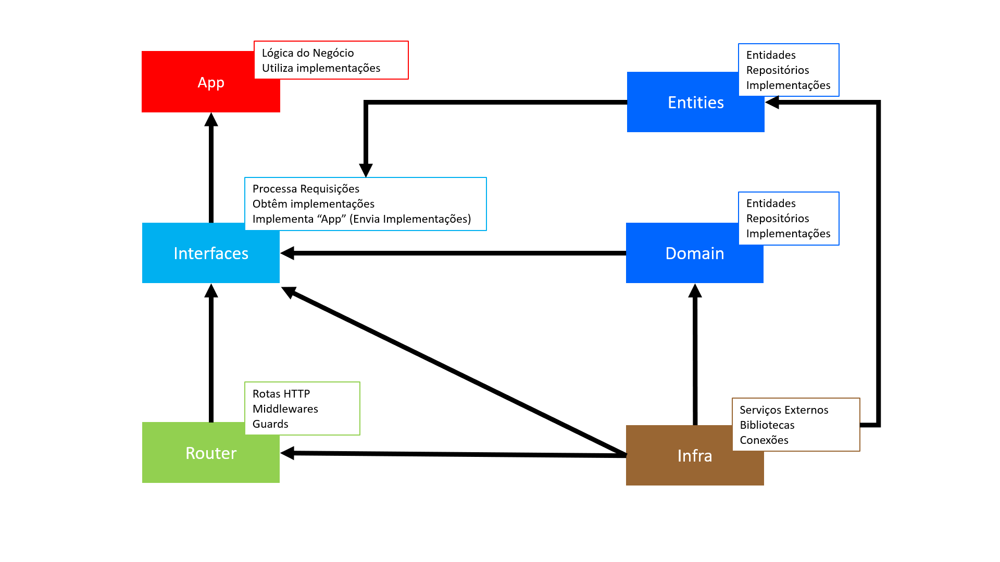

# goddd
## Arquitetura DDD + Golang

O repositório é uma API com listagem e cadastro de usuários.<br>
Foram utilizados princípios SOLID e DDD para a arquitetura, com o objetivo de proporcionar maior adaptabilidade e manutenção do código.

O fluxo de dependências dos pacotes está representado pela ilustração abaixo:



## Comandos
- Clona o repositório.
``` bash
git clone git@github.com:chrissgon/goddd.git
```
- Executa aplicação.
``` bash
go run main.go
```

## Endpoints
Lista usuários (GET) <a href="http://localhost:8080/users/">http://localhost:8080/users/</a>.<br>
Busca usuário (GET) <a href="http://localhost:8080/users/ID">http://localhost:8080/users/:ID</a>.<br>
Cadastra usuário (POST) <a href="http://localhost:8080/users/">http://localhost:8080/users/</a>.


## Referências
- [Implement Domain-Driven Design (DDD) in Golang](https://medium.com/@next_shore/implement-domain-driven-design-ddd-in-golang-ecdb6b6367ed)
- [How To Implement Domain-Driven Design (DDD) in Golang](https://programmingpercy.tech/blog/how-to-domain-driven-design-ddd-golang/)
- [Domain Driven Design (DDD) Aplicado a um Microserviço GO](http://eng.dito.com.br/domain-driven-design-ddd-aplicado-a-um-microservico-go)
- [Princípios SOLID em uma API REST com Node.js e TypeScript | Code/Drops #44](https://www.youtube.com/watch?v=vAV4Vy4jfkc)
- [SOLID fica FÁCIL com Essas Ilustrações](https://www.youtube.com/watch?v=6SfrO3D4dHM)

---
Desenvolvido por [Christopher Gonçalves](https://github.com/chrissgon)
